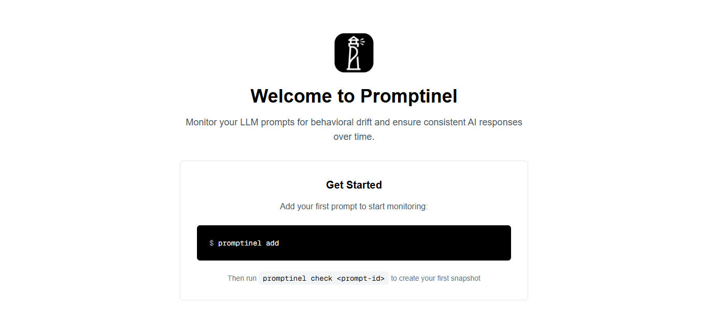
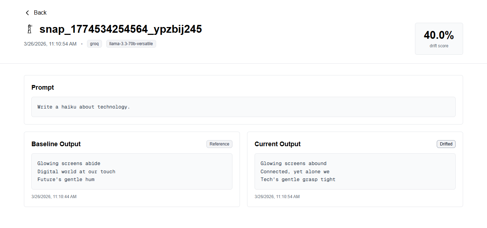

<div align="center">
  

**Monitor LLM prompt behavior and detect drift before users notice.**

<p align="center">
  <a href="https://github.com/diegosantdev/promptinel/stargazers"></a>
  <a href="https://github.com/diegosantdev/promptinel/network/members"></a>
  <a href="LICENSE"></a>
</p>

<p align="center">
  <a href="https://github.com/diegosantdev/promptinel/actions/workflows/ci.yml"></a>
</p>

<p>
  =18" />
  
  
  
  
  
</p>

<p>
  
  
  
  
  
  
</p>

<p>
  <a href="#why-promptinel">Why Promptinel</a> •
  <a href="#features">Features</a> •
  <a href="#quick-start">Quick Start</a> •
  <a href="#providers">Providers</a> •
  <a href="#commands">Commands</a> •
  <a href="#github-actions">GitHub Actions</a> •
</p>

</div>

---

## Why Promptinel

**Promptinel doesn't just measure drift, it explains it.**

LLMs change behavior silently. A prompt that worked perfectly last month may produce different output today because a provider updated a model, changed routing, or shifted hidden behavior behind an alias like `gpt-4o`.

Promptinel is the **first open-source drift monitoring tool** that actually explains the shift. While traditional evaluation tools focus on raw numeric scores, Promptinel provides actionable, human-readable insights.

- **Human-readable drift explanation**: "The model is now more verbose and technical than the baseline."
- **Silent Model Update detection**: Automatically detects when providers update models behind the scenes.
- **Agent drift monitoring**: Supported via multi-step and tool call tracking (v2).
- **Provider agnostic**: Works with OpenAI, Anthropic, Mistral, and local Ollama.
- **Zero-config mock mode**: Test your CI pipeline with simulated drift, no API keys required.

<div align="center">
  
</div>

---

## At a Glance

| **Explainable Drift** | **✓ numeric + LLM explanation** |
| **Silent Model Tracking** | **✓ detects silent alias updates** |
| **Agent Monitoring** | **✓ multi-step + tool calls (v2)** |
| **Zero-Config** | **✓ mock mode / simulated drift** |
| **Open Source** | **✓ MIT License / Community first** |
| **Developer Experience** | **✓ clone, npm install, run** |

Even when your application code has not changed, model behavior can change in ways that impact:

- classification
- extraction
- summarization
- support automation
- routing logic
- safety behavior
- formatting consistency
- agent workflows
- tool calls
- downstream reliability

That means your prompt can quietly regress while your CI still looks green.

Promptinel is built to catch that early.

---

## What Promptinel does

- snapshots prompt outputs
- creates and manages baselines
- detects semantic drift
- scores drift from `0.0` to `1.0`
- alerts when thresholds are exceeded
- works with real providers and local models
- runs instantly in mock mode with zero config
- fits naturally into CI/CD workflows
- stores everything in simple JSON files
- provides both CLI workflows and a dashboard

---

## Core flow

```text
Add prompt
   ↓
Create baseline
   ↓
Run on schedule
   ↓
Compare semantically
   ↓
Alert on drift
```

---

## Why this project is different

The most important design choice in Promptinel is **automatic mock mode**.

That means:

- anyone can clone the repo and run it immediately
- contributors do not need API keys to test the project
- CI can run without secrets by default
- demos work out of the box
- onboarding friction stays extremely low

That one decision makes Promptinel dramatically more usable as an open source project.

---

## Features

### Zero-config mock mode
If no provider credentials are found, Promptinel automatically falls back to **mock mode**.

This lets anyone run the project in seconds with no setup cost.

### Semantic drift detection
Promptinel compares outputs semantically instead of relying only on exact text matching.

### LLM-as-judge scoring
By default, Promptinel uses an LLM judge to determine whether the current output meaningfully differs from the baseline.

### Optional embeddings comparison
When supported and configured, Promptinel can also use embeddings similarity as an alternative scoring method.

### Multi-provider support
Use mock, local, or hosted models with a simple provider interface.

### JSON flat-file storage
No database. No migrations. No setup headache.

### Slack alerts
Get notified when a prompt drifts beyond its configured threshold.

### CI/CD integration
Run scheduled checks in GitHub Actions and other automation environments.

### Visual diff
Compare baseline vs current output side by side.

### Dashboard
Inspect prompt status, history, snapshots, and drift trends visually.

<div align="center">
  
  <p><em>Compare baseline vs current output and see the exact drift score.</em></p>
</div>

---

## Quick Start

### Install globally

```bash
npm install -g promptinel
```

### Or run from source

```bash
git clone https://github.com/diegosantdev/Promptinel.git
cd Promptinel
npm install
```

---

## 30-second demo

```bash
node bin/promptinel.js add
node bin/promptinel.js check my-prompt
node bin/promptinel.js baseline my-prompt --latest
node bin/promptinel.js check my-prompt
node bin/promptinel.js diff my-prompt
node bin/promptinel.js report
```

If no provider credentials are configured, Promptinel automatically uses **mock mode**.

---

## Example workflow

### 1. Add a prompt

```bash
node bin/promptinel.js add
```

You will be guided through:

- prompt id
- messages or prompt text
- provider
- model
- drift threshold
- optional tags

### 2. Check the prompt

```bash
node bin/promptinel.js check classify-intent
```

This creates a new snapshot.

### 3. Set a baseline

```bash
node bin/promptinel.js baseline classify-intent --latest
```

Now Promptinel knows what expected behavior looks like.

### 4. Check again later

```bash
node bin/promptinel.js check classify-intent
```

Promptinel compares the current output against the baseline and calculates drift.

### 5. View a diff

```bash
node bin/promptinel.js diff classify-intent
```

### 6. Generate a report

```bash
node bin/promptinel.js report
```

When watching your prompts, Promptinel provides clear visual feedback right in your terminal:

📊 **extract-entities**   Provider: **[MOCK]**
Model: **mock-default**

⚠️ **SILENT MODEL UPDATE DETECTED**
The provider updated the model version behind the alias.
Previous: `mock-default-v1.2.2`
Current: `mock-default-v1.2.3`

📝 **BEHAVIOR CHANGE:**
The model has become more verbose and added technical details not present in the baseline.

Drift: **0.450** ⚠️ **DRIFT**


---

## Drift scoring

Each check produces a **drift score from 0 to 1**.

| Status  | Score range |
|---------|-------------|
| Stable  | 0.00 – 0.15 |
| Warning | 0.15 – 0.35 |
| Drifted | 0.35+       |

### Default scoring method
**LLM-as-judge**

Works across providers and is the default comparison mechanism.

### Optional scoring method
**Embeddings similarity**

Useful when configured and supported, especially for alternate comparison flows.

---

## Providers

### Mock
Best for demos, CI, testing, and zero-config onboarding.

- no API key required
- deterministic and test-friendly
- simulates drift patterns
- perfect for GitHub Actions
- zero cost

### Ollama
Best for free local testing with real models.

- runs locally
- no API cost
- private by default
- good for experimentation

### OpenAI
Supported through `OPENAI_API_KEY`.

Examples:
- `gpt-4o`
- `gpt-4o-mini`
- `gpt-3.5-turbo`

Embeddings:
- `text-embedding-3-small`

### Anthropic
Supported through `ANTHROPIC_API_KEY`.

Examples:
- `claude-3-5-sonnet`
- `claude-3-haiku`

### Mistral
Supported through `MISTRAL_API_KEY`.

Examples:
- `mistral-large`
- `mistral-small`
- `open-mistral-7b`

---

## Provider selection behavior

Promptinel can follow a practical fallback strategy:

1. configured cloud provider
2. local provider like Ollama
3. mock mode when no credentials are available

That keeps the repo usable in clean environments and makes onboarding much smoother.

---

## Commands

### `node bin/promptinel.js add`
Add a new prompt to the watchlist.

```bash
node bin/promptinel.js add
```

### `node bin/promptinel.js check <id>`
Run a prompt once, create a snapshot, and compare to the baseline if one exists.

```bash
node bin/promptinel.js check classify-intent
```

### `node bin/promptinel.js watch`
Run all prompts on a recurring monitoring pass.

```bash
node bin/promptinel.js watch
```

### `node bin/promptinel.js diff <id>`
Compare the current snapshot against baseline or recent state.

```bash
node bin/promptinel.js diff classify-intent
```

### `node bin/promptinel.js baseline <id>`
Promote the latest or selected snapshot to baseline.

```bash
node bin/promptinel.js baseline classify-intent --latest
```

### `node bin/promptinel.js report`
Generate a drift report in JSON.

```bash
node bin/promptinel.js report
```

### `node bin/promptinel.js dashboard`
Start the dashboard.

```bash
node bin/promptinel.js dashboard
```

### `node bin/promptinel.js cleanup`
Delete old snapshots according to retention policy.

```bash
node bin/promptinel.js cleanup
```

---

## Example watchlist entry

```json
{
  "id": "summarize-support-ticket",
  "provider": "mock",
  "model": "mock-v1",
  "threshold": 0.28,
  "messages": [
    { "role": "system", "content": "You summarize support tickets clearly and concisely." },
    { "role": "user", "content": "Customer says billing failed twice and wants a refund." }
  ],
  "tags": ["support", "summary", "billing"]
}
```

---

## Storage

Promptinel uses a simple flat-file structure.

```text
.promptinel/
  snapshots/
    summarize-support-ticket.json
    classify-intent.json
    extract-entities.json
  history.json
watchlist.json
```

### Why this storage model
- zero config
- easy local inspection
- no database dependency
- portable
- easy to ignore in Git
- easy to back up

---

## Environment variables

```bash
# OpenAI
OPENAI_API_KEY=your_key_here

# Anthropic
ANTHROPIC_API_KEY=your_key_here

# Mistral
MISTRAL_API_KEY=your_key_here

# Ollama
OLLAMA_BASE_URL=http://localhost:11434

# Slack
SLACK_WEBHOOK_URL=https://hooks.slack.com/services/...

# Optional runtime flags
PROMPTINEL_HTTP_MODE=live
PROMPTINEL_FIXTURES_DIR=.promptinel/fixtures
```

---

## Optional config

Create `.promptinel/config.json`:

```json
{
  "defaultProvider": "mock",
  "defaultThreshold": 0.3,
  "retentionDays": 30
}
```

---

## GitHub Actions

```yaml
name: Prompt Drift Monitoring

on:
  schedule:
    - cron: '0 * * * *'
  workflow_dispatch:

jobs:
  monitor:
    runs-on: ubuntu-latest

    steps:
      - name: Checkout repository
        uses: actions/checkout@v4

      - name: Setup Node
        uses: actions/setup-node@v4
        with:
          node-version: 18

      - name: Install dependencies
        run: npm install

      - name: Run Promptinel
        env:
          SLACK_WEBHOOK_URL: ${{ secrets.SLACK_WEBHOOK_URL }}
          OPENAI_API_KEY: ${{ secrets.OPENAI_API_KEY }}
        run: node bin/promptinel.js watch
```

### Recommended CI strategy

- use mock mode by default
- inject real provider keys only when needed
- keep checks lightweight
- run scheduled drift monitoring separately from unit tests

---

## Slack alerts

Promptinel can notify your team when drift exceeds a prompt threshold.

Typical alert payload can include:

- prompt id
- score
- severity
- threshold
- timestamp
- baseline snapshot id
- current snapshot id
- quick diff preview

---

## Real-world use cases

### Production monitoring
Catch prompt behavior changes before users do.

### Model migration validation
Check how moving from one model version to another changes behavior.

### Prompt engineering workflows
Compare variants and validate whether improvements are real.

### Audit support
Maintain prompt history for review, traceability, and reliability checks.

### Regression detection in CI
Spot drift before deployment or release.

---

## Project structure

```text
promptinel/
├── src/
│   ├── cli.js
│   ├── types.js
│   ├── providers/
│   │   ├── mock.js
│   │   ├── ollama.js
│   │   ├── openai.js
│   │   ├── anthropic.js
│   │   └── mistral.js
│   └── services/
│       ├── storage.js
│       ├── watchlist.js
│       ├── scorer.js
│       ├── runner.js
│       └── notifier.js
├── dashboard/
│   ├── app/
│   ├── components/
│   └── lib/
├── bin/
│   └── promptinel.js
├── tests/
│   ├── unit/
│   └── property/
├── docs/
│   ├── GITHUB_ACTIONS.md
│   └── ENVIRONMENT.md
├── .env.example
├── watchlist.json
└── .promptinel/
```

---

## Testing

```bash
npm test
```

Coverage:

```bash
npm run test:coverage
```

Watch mode:

```bash
npm run test:watch
```

Specific file:

```bash
npm test -- tests/unit/services/storage.test.js
```

---

## Development

```bash
git clone https://github.com/diegosantdev/Promptinel.git
cd Promptinel
npm install
npm test
npm run dev
```

---

## Contributing

Contributions are welcome.

1. fork the repo
2. create a feature branch
3. commit your changes
4. push the branch
5. open a pull request

```bash
git checkout -b feature/improve-scoring
git commit -m "Improve drift scoring output"
git push origin feature/improve-scoring
```

---

## License

MIT © 2026 [@diegosantdev](https://github.com/diegosantdev)

---

## Support the project

If Promptinel is useful to you:

- star the repo
- open an issue
- suggest features
- share it with teams building with LLMs

---

<div align="center">

**Prompt behavior changes silently. Promptinel makes it visible.**

---

Built and maintained by [@diegosantdev](https://github.com/diegosantdev)

</div>